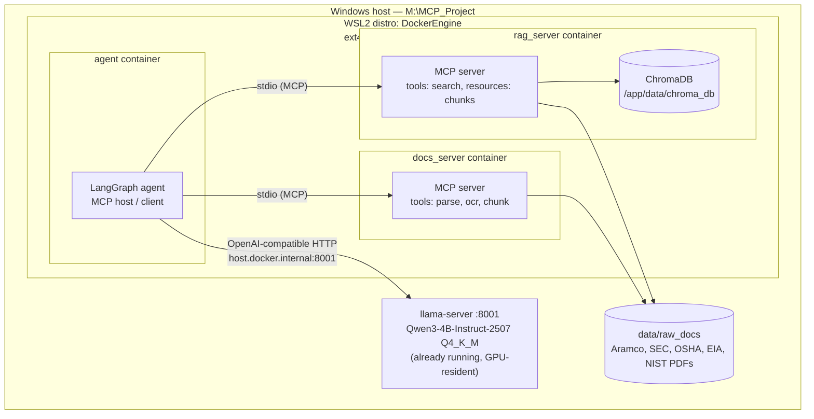

# High-Level Design — Sovereign MCP Platform

**Project root:** `M:\MCP_Project`
**Status:** Design baseline for Phases 1–6
**Author context:** Local, open-source, single-GPU, air-gapped-style deployment for MCP mastery + portfolio artifact

---

## 1. Purpose and scope

Build a locally-run, fully open-source multi-agent platform that demonstrates the
Model Context Protocol (MCP) end to end: a LangGraph agent acting as MCP host/client,
two independent MCP servers (retrieval-augmented search, document parsing/OCR), all
orchestrated through Docker containers, and all reasoning performed by a single
already-running local LLM. No component may depend on a cloud API, external network
call, or a second model instance.

**In scope:** MCP server/client implementation, local RAG, document intelligence,
containerization, basic auth pattern, storage governance.

**Out of scope:** multi-user auth/RBAC, horizontal scaling, GPU multi-tenancy, any
cloud deployment target — this is a single-laptop reference architecture, not a
production system. (Trade-off stated explicitly because "what would you add for
production" is a predictable interview follow-up — see §8.)

---

## 2. Architecture overview

**Key architectural decision:** the LLM is a shared external dependency, not a
container in this stack. It is served once, on the host GPU, by `llama-server`, and
every container reaches it over `host.docker.internal:8001`. This mirrors how a real
sovereign deployment would centralize a scarce GPU resource behind one inference
endpoint rather than duplicating it per service.

---

## 3. Components

| Component | Responsibility | Technology | Transport in |
|---|---|---|---|
| `agent` | MCP host/client; owns the reasoning loop; decides which server/tool to call | LangGraph, Python | stdio to servers, HTTP to LLM |
| `rag_server` | Vector search over ingested documents; exposes chunks as MCP resources | `mcp` SDK, ChromaDB, `bge-small-en-v1.5` | stdio (Phase 1–4), SSE+API-key (Phase 5 variant) |
| `docs_server` | PDF parsing, OCR, chunking of raw documents | `mcp` SDK, `unstructured`, `pytesseract` | stdio |
| `llama-server` | LLM inference, OpenAI-compatible API | llama.cpp, Qwen3-4B-Instruct-2507 GGUF | HTTP `/v1/chat/completions` |
| `ChromaDB` | Persisted vector store | file-based, bind-mounted | embedded in `rag_server` |

---

## 4. Data flow (RAG query path)

1. User query enters `agent` (LangGraph).
2. Agent calls Qwen3 via `host.docker.internal:8001/v1` to decide: does this need
   retrieval?
3. If yes, agent invokes `rag_server.search_documents(query)` over MCP (stdio).
4. `rag_server` embeds the query (`bge-small-en-v1.5`), queries ChromaDB, returns
   top-k chunks as MCP resources.
5. Agent assembles context, calls Qwen3 again for the final answer.
6. If the query needs parsing of a not-yet-ingested scanned document, agent instead
   routes to `docs_server.parse(file)`, which returns extracted text, which then
   flows back through the ingest path into ChromaDB for future queries.

---

## 5. Deployment topology

- **Docker Engine runs inside a custom-imported WSL2 distro (`DockerEngine`)**, not
  Docker Desktop — its `ext4.vhdx` is imported directly onto `M:\WSL\DockerEngine\`,
  guaranteeing every image layer, container, volume, and build-cache entry lives on
  M:\ by construction, not by configuration that could drift.
- `M:\MCP_Project` is bind-mounted into containers via `/mnt/m/MCP_Project` inside the
  distro; `docker compose` is always run from that path.
- No named Docker volumes are used — only bind mounts to `./data`, so nothing lands
  in Docker's internal volume store either.
- See `resource-governance.md` for the storage budget, cache redirection, and
  cleanup routine that keep this guarantee true over time.

---

## 6. Technology stack

| Layer | Choice | Rationale |
|---|---|---|
| MCP SDK | Official Python `mcp` package | Reference implementation, matches spec exactly |
| Agent orchestration | LangGraph | Existing skill area; explicit graph control over tool routing |
| LLM serving | llama.cpp `llama-server` | Already running; GGUF quantization fits laptop GPU/VRAM budget |
| Embeddings | `BAAI/bge-small-en-v1.5` | Small, CPU-viable, no API dependency |
| Vector store | ChromaDB | File-based, zero extra infra, good enough at this corpus scale |
| Document parsing | `unstructured` + `pytesseract` | Open source, handles both text-native and scanned PDFs |
| Containerization | Docker Engine (WSL2, no Desktop) | Full control over data-root location; no C:\ leakage |
| Python dependency management | `uv` | Cache and Python-install directories are explicitly redirectable off C:\, unlike pip's less consistent defaults; faster rebuilds across phases |

---

## 7. Non-functional requirements

| Requirement | Target | Notes |
|---|---|---|
| Storage — C:\ impact | 0 bytes | Enforced via WSL distro placement + cache env vars |
| Storage — M:\ budget | 20 GB free before start | See resource-governance.md for breakdown |
| LLM instances | Exactly 1 (port 8001) | No component may load a second model |
| Network egress | None after initial `pip`/model pulls | True air-gap simulation post-setup |
| Retrieval latency | Not a target — this is a correctness/architecture exercise, not a perf benchmark | State this explicitly if asked; don't over-promise numbers on a 4B model + CPU embeddings |

---

## 8. Trade-offs and risks (volunteer these in review)

| Decision | Trade-off | Mitigation / why acceptable here |
|---|---|---|
| Single shared LLM, no per-service instance | Serializes reasoning across agent + any future service that needs generation | Correct pattern for scarce-GPU sovereign deployments; documented as intentional |
| stdio transport for Phases 1–4 | No network auth surface at all, but also no remote access | Matches air-gapped requirement; Phase 5 adds an HTTP+auth variant to show the alternative is understood, not just avoided |
| ChromaDB file-based store | Won't scale past a few hundred thousand chunks | Acceptable for a 20–50 doc corpus; call out FAISS/pgvector as the production successor |
| No RBAC / multi-tenant auth | Not production-ready as-is | Explicitly out of scope (§1); Phase 5's API-key pattern is the seed of that, not the full answer |
| WSL2 vhdx doesn't auto-shrink | M:\ usage can look higher than actual content until compacted | Documented cleanup routine in resource-governance.md |

---

## 9. Mapping to build phases

| HLD component | Delivered in |
|---|---|
| `rag_server` (basic tool) | Phase 1 |
| `rag_server` (resources, prompts, real retrieval) | Phase 2 |
| `agent` (LangGraph host/client) | Phase 3 |
| `docs_server` + multi-server routing | Phase 4 |
| Auth-hardened transport variant | Phase 5 |
| Full docker-compose, this HLD finalized | Phase 6 |

---

## 10. Target-state architecture (North Star — not in current scope)

The current build (§1–9) is intentionally a single-agent, single-LLM, laptop-scale
reference implementation. It is a deliberate subset of a broader enterprise sovereign
AI platform pattern — the kind of architecture worth sketching in a design review to
show where the system grows next, without pretending it's buildable on one GPU today.
This section exists to document that target state and to be explicit about which
parts of it are genuine near-term extensions versus enterprise-scale-only.

**Full target-state shape** (for reference — layers beyond what §2–6 describe):

- **Access layer**: Chat UI/REST API in front of an API gateway (auth, RBAC, rate limiting)
- **Orchestration layer**: a supervisor agent routing to specialized sub-agents
  (RAG, Document, Vision, SQL, Research, Report, Code, Safety, Evaluation,
  Monitoring, Planning, Memory)
- **MCP server layer**: expands from 2 servers to 7+ (adds vision, SQL, python
  sandbox, browser, filesystem)
- **Model layer**: dedicated servers per model class — LLM, VLM, embedding,
  reranker, OCR — rather than one shared LLM endpoint
- **Knowledge layer**: adds a knowledge graph (Neo4j) and a second vector store
  (Qdrant) alongside ChromaDB, plus Redis caching and object storage
- **LLMOps layer**: prompt/model/dataset versioning, experiment tracking (MLflow),
  A/B testing, canary deployment, rollback
- **Evaluation layer**: Ragas/DeepEval/TruLens with faithfulness, hallucination
  rate, groundedness, recall/precision@K, agent success rate
- **Observability layer**: Langfuse, OpenTelemetry, Prometheus, Grafana, Loki
- **Security layer**: Keycloak, HashiCorp Vault, RBAC, audit logs, per-agent and
  per-MCP-tool permissions

**Why this stays out of scope for now — the constraint, not just the effort:**

| Target-state assumption | Conflicts with |
|---|---|
| Separate GPU-resident LLM, VLM, embedding, reranker servers | resource-governance.md §3 — exactly one LLM instance on the one available GPU |
| 10+ specialized agents | One 4B model has no spare capacity to serve concurrent agent reasoning loops without serializing them anyway — more agents ≠ more throughput here |
| Neo4j + Qdrant + Redis + MLflow + Langfuse + Prometheus + Grafana + Keycloak + Vault, all running | resource-governance.md §2 — 20 GB M:\ budget for the entire current project; several of these services alone approach that individually |
| Kubernetes-ready scale-out | Explicitly named as a current skill gap (see personal context), not something to architect blind ahead of hands-on K8s depth |

**Genuine near-term candidates** (if the project continues past Phase 6, evaluate
these individually against the storage/compute budget before committing — do not
adopt this section wholesale):

| Candidate | Why it's realistic | What it would cost |
|---|---|---|
| A lightweight evaluation harness (Ragas, faithfulness + recall@K only) | Directly strengthens the "how do you validate a RAG system" interview story; runs as a script, not a service | Low — a Python dependency, no new container |
| A second agent role (e.g. a router splitting "retrieval" vs "document" intents before delegating) | Demonstrates actual multi-agent orchestration, not just multi-tool | Low-moderate — still one shared LLM, just a second LangGraph node |
| Langfuse or plain OpenTelemetry tracing on the agent | Observability is a named gap area; a single tracing container is cheap | Moderate — one more container, modest storage |

**Everything else in the target-state diagram (Neo4j, Qdrant, Keycloak, Vault,
MLflow, Prometheus/Grafana, VLM/reranker/OCR model servers, Kubernetes) remains
documented here as the answer to "how would this scale," and is explicitly not
a build target for this project.**
