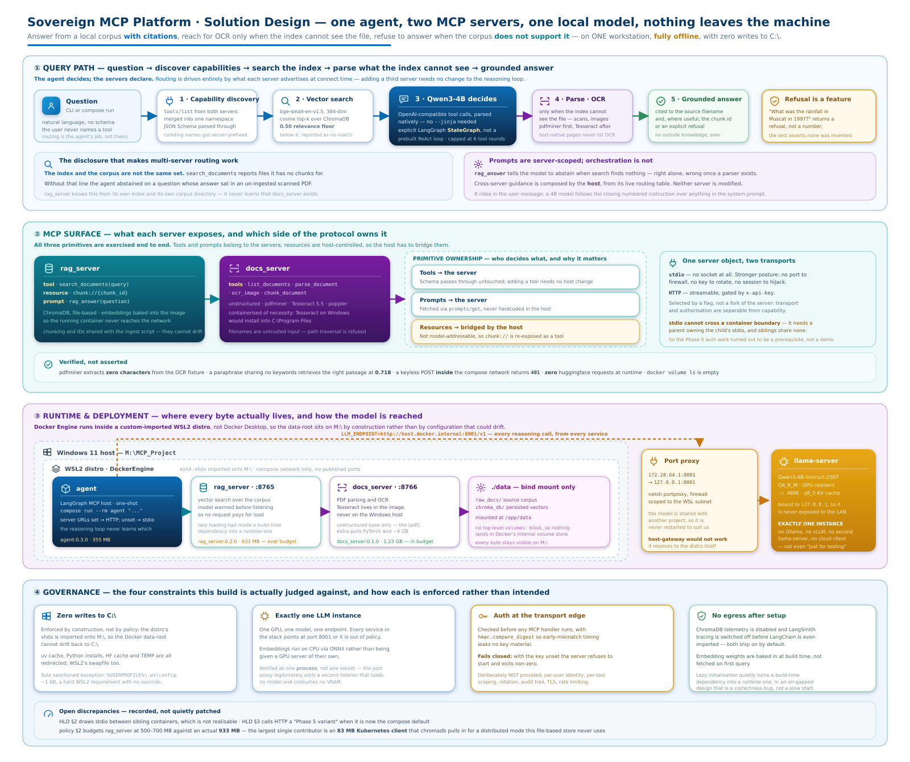

# Enclave-MCP

A locally-run, fully open-source platform demonstrating the **Model Context Protocol**
end to end: a LangGraph agent acting as MCP host over two independent MCP servers, with
every reasoning step served by one already-running local LLM.

No cloud API. No second model. No writes to `C:\`.



> Full-fidelity version: open [`design/index.html`](design/index.html) — a single
> self-contained page. Rationale and trade-offs: [`docs/design.md`](docs/design.md).

---

## What it does

Ask a question in natural language. The agent discovers what each server can do, searches
the vector index, reaches for OCR only when the index cannot see a file, and answers with
citations — or refuses, when the corpus does not support an answer.

```
$ docker compose run --rm agent "What does the scanned hot work document say a permit must document?"

[agent] connected to rag_server v0.2.0 (http)
[agent] connected to docs_server v0.1.0 (http)
[agent] merged tool namespace: ['chunk_document', 'list_documents', 'ocr_image',
                                'parse_document', 'read_chunk', 'search_documents']
[agent] [rag_server]  tools/call search_documents({'query': '...'})
[agent] [docs_server] tools/call parse_document({'filename': 'scanned_osha_hotwork.pdf'})
[docs_server] OCR over 1 rasterised page(s)

The scanned hot work document states that a hot work permit must document:
  1. That fire prevention and protection requirements have been implemented ...
  2. The date authorized for hot work.
  3. The identification of the object on which hot work is to be performed.

Source: scanned_osha_hotwork.pdf
```

That routing is not scripted. `search_documents` reports which corpus files have no chunks
in its index, and the agent decides on its own to parse one.

## Components

| Component | Responsibility | Transport | Image |
|---|---|---|---|
| `agent` | MCP host/client; owns the reasoning loop and routes across servers | — | 355 MB |
| `rag_server` | Vector search; exposes a chunk resource and a grounded-answer prompt | HTTP `:8765` · stdio | 933 MB |
| `docs_server` | PDF parsing, OCR and chunking of documents not yet ingested | HTTP `:8766` · stdio | 1.23 GB |
| `llama-server` | All inference. Shared, externally owned, never restarted by this project | HTTP `:8001` | host process |

All three MCP primitives are exercised. **Tools** and **prompts** are owned by the servers;
**resources** are host-controlled, so the host re-exposes `chunk://` as a `read_chunk` tool
and translates the call back into a `resources/read`.

## Stack

Python `mcp` SDK 2.0 · LangGraph · ChromaDB · `bge-small-en-v1.5` via ONNX ·
`unstructured` + `pdfminer` + Tesseract · llama.cpp (Qwen3-4B-Instruct-2507 Q4_K_M) ·
Docker Engine inside a dedicated WSL2 distro.

## Running it

Requires an already-running `llama-server` on port 8001 and the `DockerEngine` WSL2 distro
(see [`SKILL.md`](SKILL.md) for first-time setup).

```bash
wsl -d DockerEngine
cd /mnt/m/MCP_Project

cp .env.example .env          # then set real API keys
docker compose build
docker compose up -d rag_server docs_server
docker compose run --rm agent "What does OSHA require for mechanical integrity?"
```

Without `RAG_SERVER_URL` / `DOCS_SERVER_URL` set, the same agent code runs against servers
spawned as local subprocesses over stdio instead. The reasoning loop never learns which
transport is in use.

## Verification

Each phase ships an acceptance script that drives a real MCP client, not a mock:

```bash
.venv/Scripts/python.exe scripts/verify_phase2.py   # vector search, resource, prompt
.venv/Scripts/python.exe scripts/verify_phase3.py   # host, tool discovery, abstention
.venv/Scripts/python.exe scripts/verify_phase4.py   # OCR, traversal, cross-server routing
.venv/Scripts/python.exe scripts/verify_phase5.py   # HTTP transport and the auth boundary
```

What they assert, and why it is meaningful:

| Claim | Evidence |
|---|---|
| OCR genuinely runs | pdfminer extracts **zero characters** from the fixture; the full page still returns |
| Retrieval is semantic | a paraphrase sharing no keywords retrieves the right passage at 0.718 |
| The model abstains | an out-of-corpus question is refused, and the test asserts no figure was invented |
| Auth is enforced | a keyless POST *from inside* the compose network returns `401` |
| No runtime egress | zero requests to huggingface.co from the running container |
| Bind mounts only | `docker volume ls` is empty; the sole mount is `./data` |

## Constraints

Two are enforced rather than intended, and drive most of the design:

- **Zero writes to `C:\`.** Docker's data-root lives inside a WSL2 distro whose `vhdx` was
  imported onto `M:\`, so it cannot drift back. Package caches, Python installs and the
  WSL2 swapfile are all redirected. The one sanctioned exception is `.wslconfig` (~1 KB,
  a hard WSL2 requirement with no override).
- **Exactly one LLM instance.** One GPU, one model, one endpoint. Verified as one
  *process*, not one socket — the WSL port proxy legitimately adds a second listener that
  loads no model and consumes no VRAM.

See [`resource-governance.md`](resource-governance.md) for the enforceable policy and
[`HLD.md`](HLD.md) for the architecture baseline.

## Known limitations

- The scanned fixture is **synthetic** — the real PDF corpus is not in the repo.
  Reproducible via `scripts/make_scanned_fixture.py`.
- The 0.50 similarity floor is calibrated against three fixtures and needs retuning
  against a real corpus.
- `docs_server` output is not fed back into ChromaDB; OCR text reaches the agent but does
  not persist to the index.
- `rag_server` is 933 MB against a documented 500–700 MB budget. The largest single
  contributor is an 83 MB Kubernetes client that `chromadb` pulls in for a distributed
  mode this file-based store never uses. Recorded rather than quietly patched — see
  [`docs/design.md`](docs/design.md).

## Repository layout

```
agent/                  LangGraph MCP host + Dockerfile
servers/rag_server/     vector search server, shared retrieval layer
servers/docs_server/    PDF/OCR server
scripts/                ingest, per-phase verification, setup helpers
design/                 solution design (self-contained HTML + diagram)
docs/design.md          decision record and trade-offs
HLD.md                  architecture baseline
resource-governance.md  storage and compute policy
```

## Licence

MIT — see [`LICENSE`](LICENSE).
